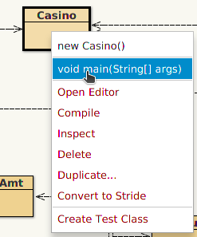
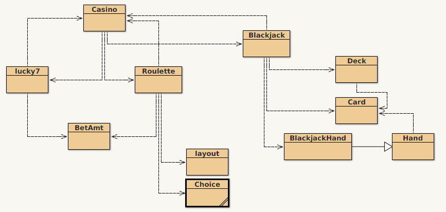
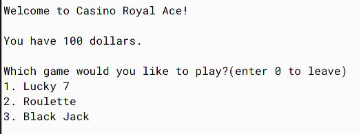
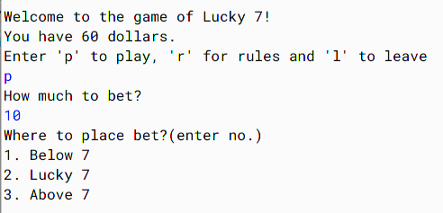
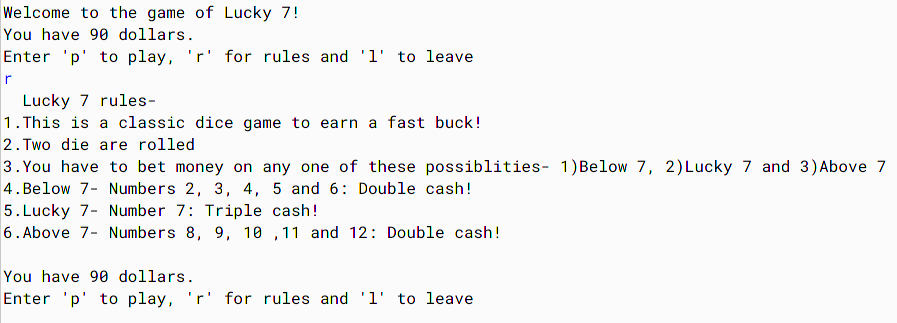
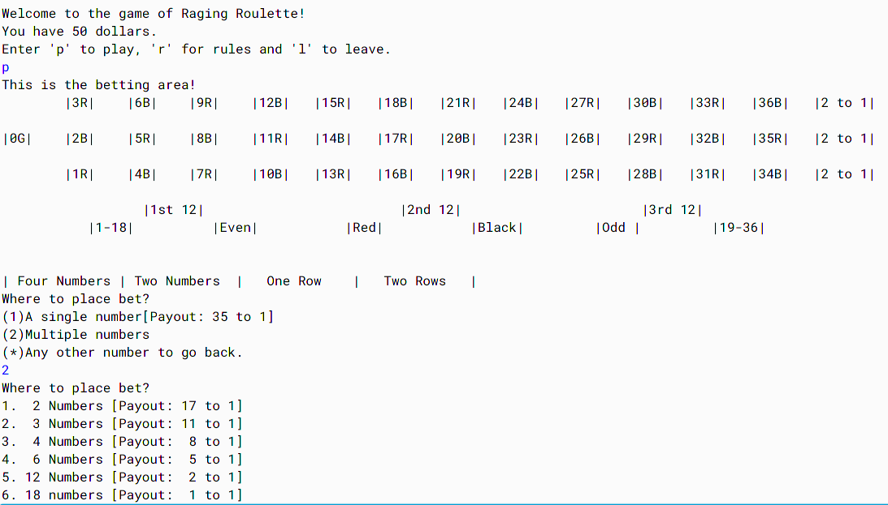
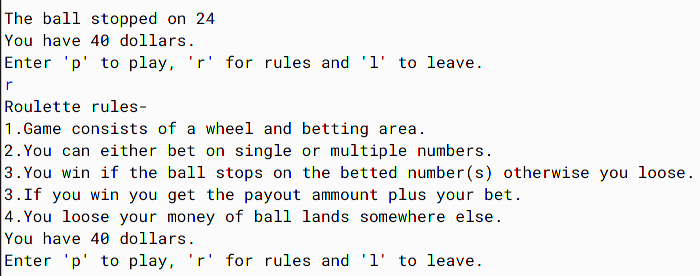
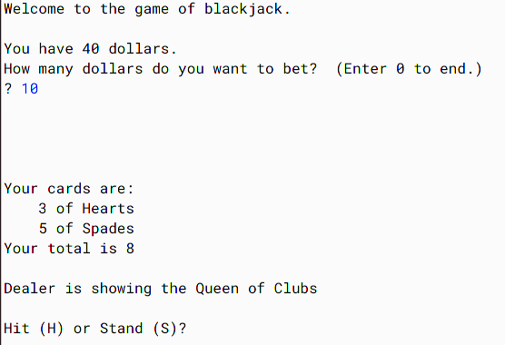

# Casino Royal Ace: Computer Science ICSE project (2012) in Java
[](https://repl.it/github/greedyshardul/Casino-java)

This is my 10th grade school project. I created a command line based casino with three functional games- Lucky 7, Roulette and BlackJack.

## Environment used
Java SE with BlueJ IDE.

## How to run
1. Terminal
```sh
javac Casino.java
java Casino
```

2. BlueJ
Call ```main()``` on Casino class   


## Architecture


## Working
### Casino class
Contains main() method. It displays the start screen and launches the game selected by the user.


### lucky7 class
Launches lucky 7 game. Player wages money and wins or loses based on a randomly generated number(dice roll).


#### Lucky7 rules


#### Helper classes
1. **BetAmt**: Logic to accept money from player.

### Roulette class


#### Roulette rules


#### Helper classes
1. **BetAmt**: Logic to accept money from player.
2. **Layout**: Roulette table layout
3. **Choice**: To accept user choice and perform exception handling.

### BlackJack class
This has the most complex working. Here the player plays against the dealer(computer).

#### Helper classes
1. **Card**: Getter and setters for card value and suit.
2. **Deck**: Array of 52 cards. It randomly shuffles cards and deals cards.
3. **Hand**: Stores cards using 'Vector' class. It has functions to add, remove, get and sort cards.
4. **BlackJackHand**: Inherits 'Hand' class. It calculates value of player's hand.
#### Blackjack rules
1. Player wins by beating the dealer- player's hand should have higher value without going bust(going over 21).
2. Card values:
    - 1 to 9 have face value
    - 10,Jack, Queen, King have value of 10
    - Ace can have value of 1 or 11
3. **Blackjack**: Player automatically wins if he shows a blackjack(Ace + any card with value of ten). This is called a blackjack. The opponent can counter it by playing his own blackjack.

#### Working
- Every player gets 2 cards which are visible to everyone, except the dealer whose one card is hidden.
- Moves
    - **Hit**: Getting more cards. Player can get as many as he wants.
    - **Stand**: Stay where you are.
    - **Double down**: Double your bet and get an an extra card.
    - **Split**: Split your hand into 2 hands when you have cards with identical value. Each hand plays separately.

#### Limitations
1. Only single player who plays against computer.
2. Double down and split not implemented.
3. Higest value of ace not leading to a bust is assigned to Ace. Player can't chose value on his own.
4. Card suits(ace, diamonds etc) have no effect.
